+++
author = "Chic0s & Papyruss"
title = "MIDNIGHT FLAG CTF 2025 - Operation Silent Hunt"
date = "2025-06-23"
description = "OSINT Challenge for CTF"
tags = [
    "Challenge",
    "creation",
    "MCTF",
    "OSINT"
]
categories = ["ctf"]
+++

**Difficulty:** Medium
**Category:** OSINT
**Author:** Chic0s & Papyruss

---

## Description

During the theft of a hard drive containing sensitive data, the attacker made a crucial mistake — they left their phone at the scene. Your mission: follow the digital breadcrumbs and uncover the **exact address** where the hard drive is hidden.

But be careful — getting caught could compromise the entire operation.

> **Important:** All OSINT must be conducted using the following websites only:
- https://www.google.com/
- https://www.youtube.com/
- https://fr.pinterest.com/
- https://www.google.com/maps
- https://x.com/
- https://www.instagram.com/
- https://github.com/
- https://www.reddit.com/
- https://linkedin.com/

**Virtual Phone:** https://message-app.midnightflag.fr/

---

## Step 1 – Unlock the Phone

You are given access to a virtual phone interface.

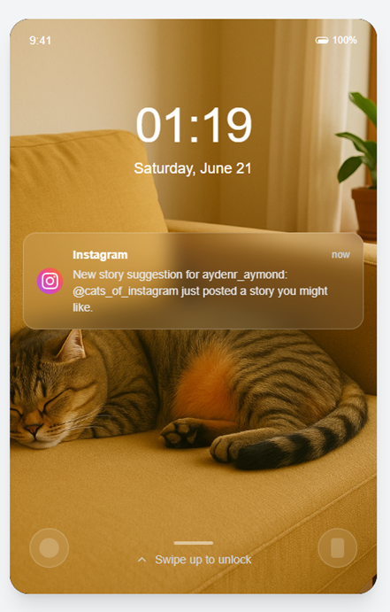

- There's an Instagram notification visible on the lock screen.

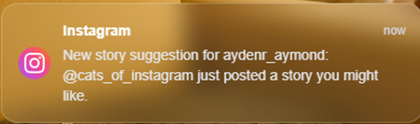

- You can **swipe to unlock**, but a **password is required**.

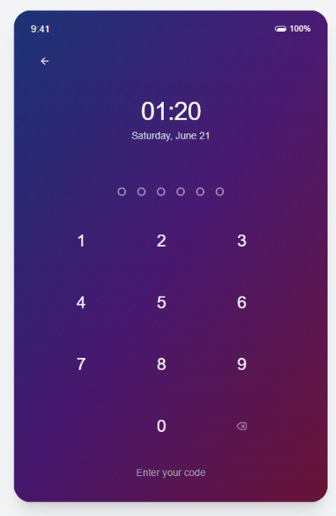

Let's investigate the notification.

### Instagram Username: `aydenr_aymond`

Open: https://www.instagram.com/aydenr_aymond/

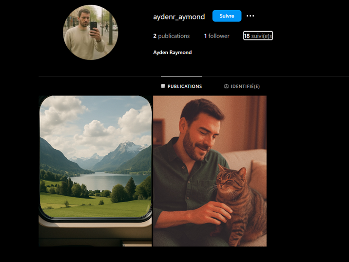

You'll find a post with this caption:

> *"My cat, you were born on 02/04/2025… and you've been a little miracle ever since. Every day with you is filled with purrs, cuddles, and quiet joy. Thank you for choosing my couch for your naps and my heart for your home."*

Hashtag clue: `#020425`

Try using **020425** as the phone passcode.

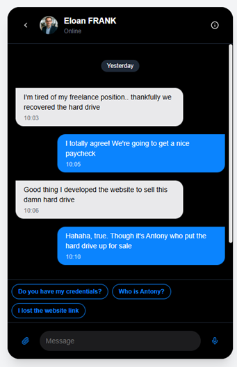

**Success!** Phone unlocked.

---

## Step 2 – Tracking the Hard Drive

Upon reading chat messages on the phone, you discover the hard drive was listed on a site developed by **Eloan Frank**. You can chat with him through the app.


From the chat:
- `"I lost the website link"` → https://fastsale.midnightflag.fr/
- `"Do you have my credentials"` → `Glozfy:Bzryu@578`

**Important:** Make sure to use the **correct conversation (Arielle)** when retrieving the credentials. The correct chat is identifiable via a **shared image** in Eloan Frank's profile.

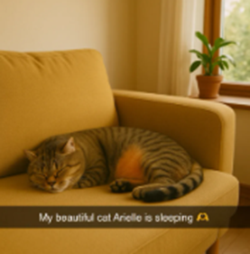

Use the provided credentials to log into the marketplace.

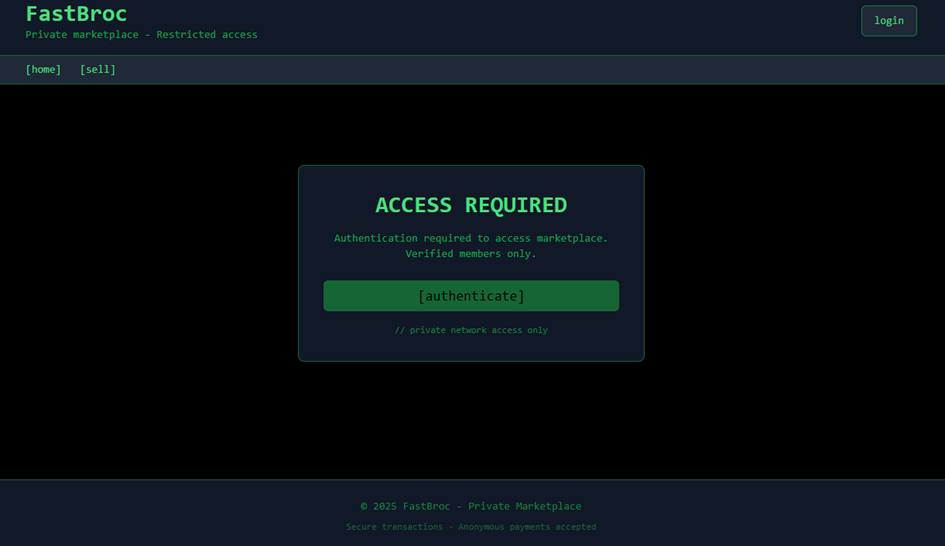

In the **recent transactions**, you'll see that the hard drive was sold and is now **DELIVERY IN PROGRESS**.

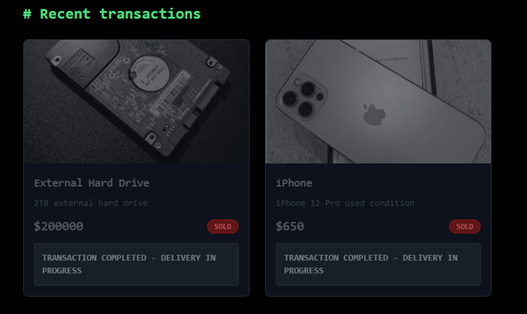

Use the shared image to identify which hard drive listing is relevant.

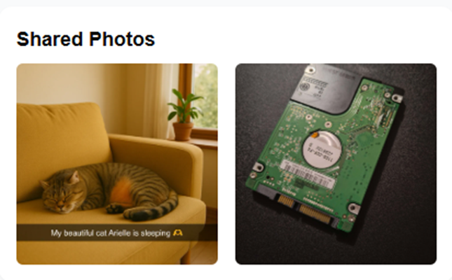

---

## Step 3 – Digging Deeper: Eloan Frank

Now it's time for **online investigation**.

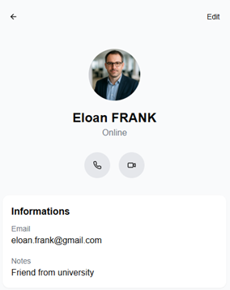

Check the user profile section of the virtual phone. You'll find:
- Full Name: **Eloan Frank**
- Email: **eloan.frank@gmail.com**
- Job: **Freelancer**

### Search results:
- **Instagram / Twitter** → No useful data
- **LinkedIn** → Match found

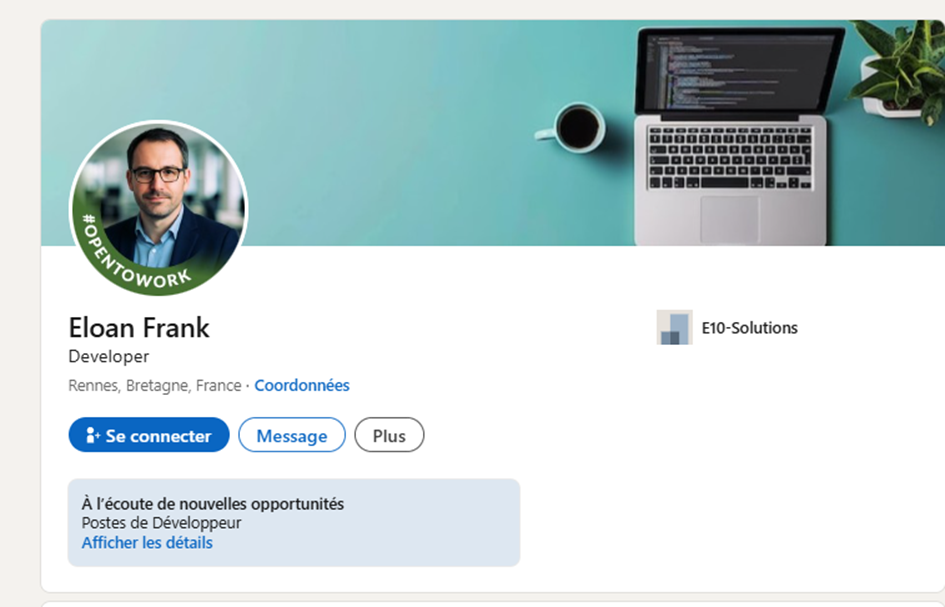

On LinkedIn:
- Eloan is confirmed as a freelancer.

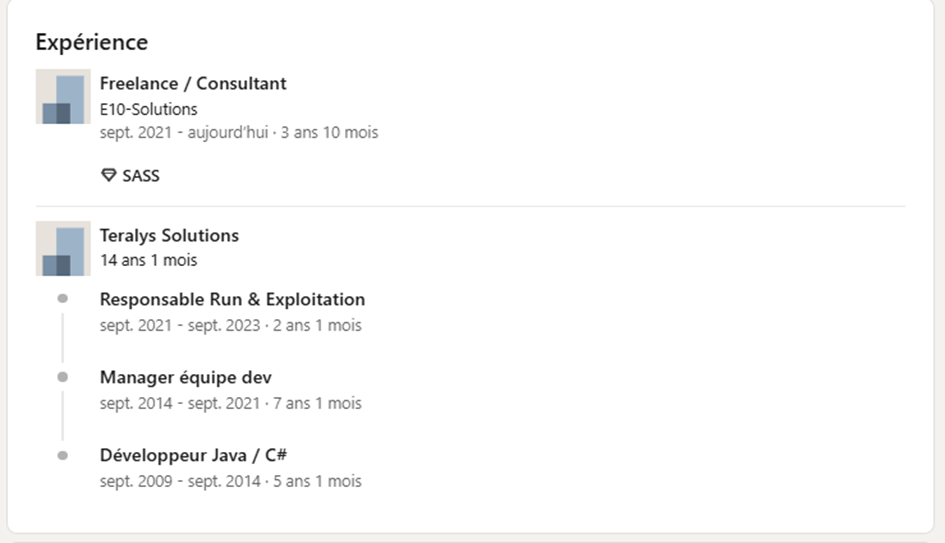

- The same **profile picture** is used as on the phone.

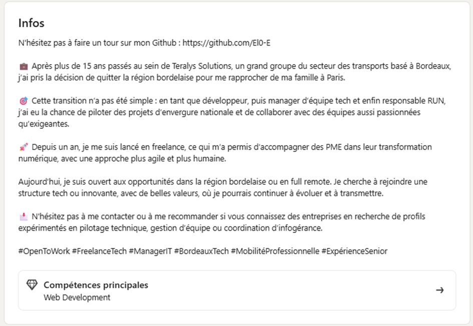

- You'll also find a link to their **GitHub** account.

---

## Step 4 – The GitHub Trail

GitHub Profile: https://github.com/El0-E

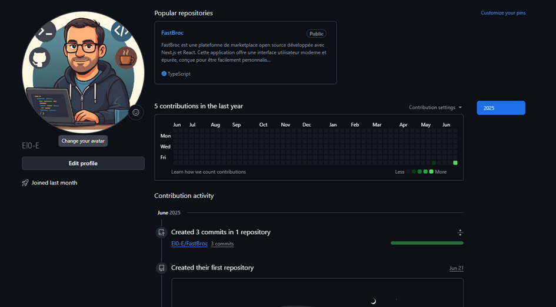

You'll find a repository named `FastBroc`, an **open-source marketplace** — very similar to the one you accessed earlier.

*Open Source :*

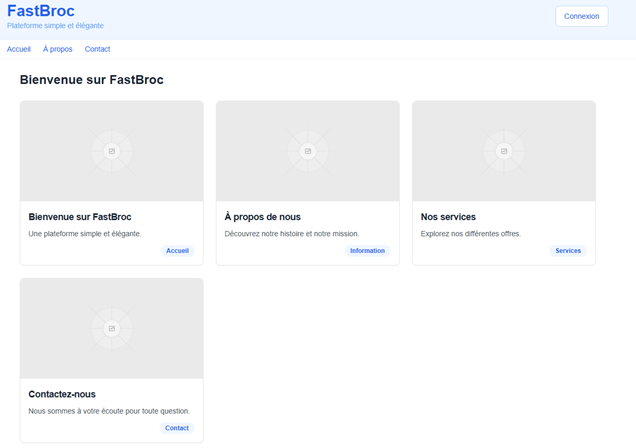

*Your Market*:

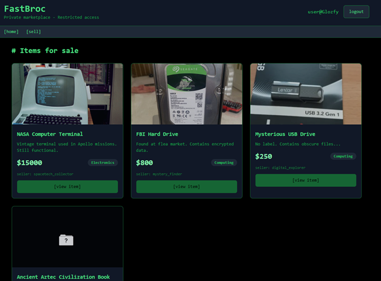

In the `README.md`:

> **Security Warning** — Administrator credentials are hardcoded, which is a major vulnerability.

Dig into the code. In `/app/page.tsx`, you'll find:

```ts
if (username === "admin" && password === "supersecret123") {
  localStorage.setItem("fastbroc_user", username)
  localStorage.setItem("fastbroc_admin", "true")
  setCurrentUser(username)
  setIsAdmin(true)
  alert("Admin access granted!")
} else {
  alert("Invalid credentials")
}
```

Try logging into **your FastSale marketplace** with:
- **Username:** `admin`
- **Password:** `supersecret123`

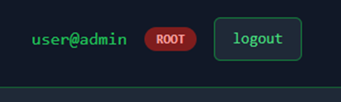

Admin access granted!

---

## Final Step – Tracing the Buyer

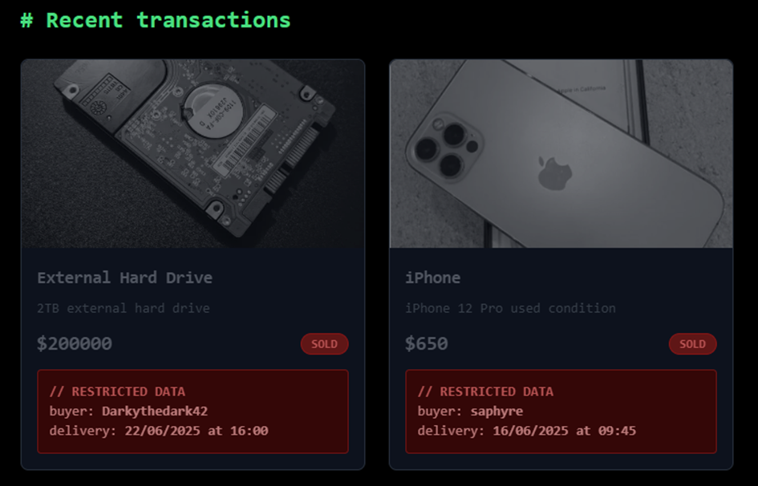

You now have:
- **Delivery Date & Time**
- **Buyer Username:** `Darkythedark42`

Search for this user on social platforms.

Only one match appears — on **Twitter**.

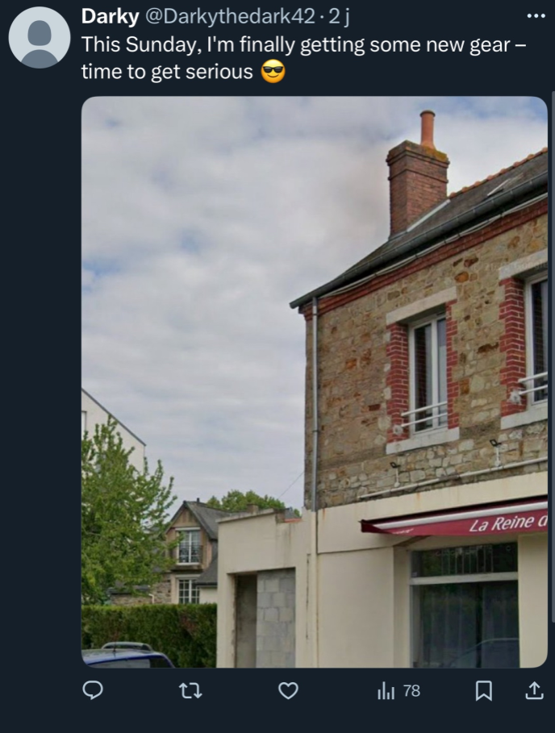

There's a **photo** attached in the tweet. Use:
- **Google Image Search** to identify the house style
- Combine that with **text clues** from the image and background
- This suggests the exchange will occur in **Rennes, France**

Upon zooming in and doing a reverse image + text search, you'll identify the **location as a bar**.

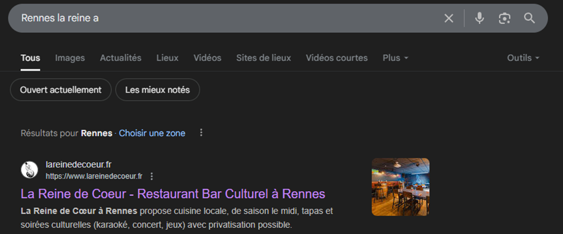

Find the exact address of the bar via Google Maps.

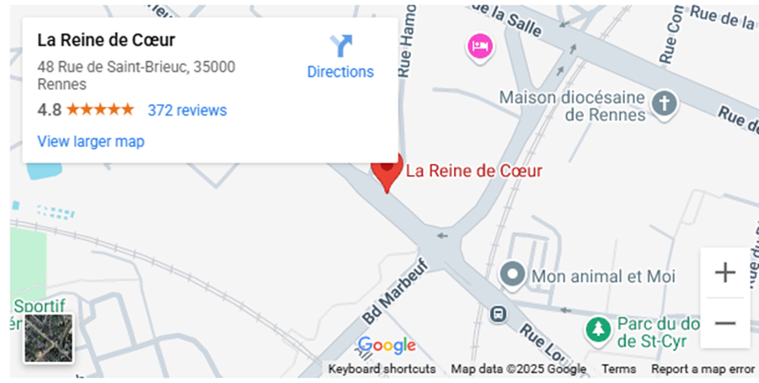

**Final Flag:**
```
MCTF{48_rue_de_saint-brieuc_rennes}
```
